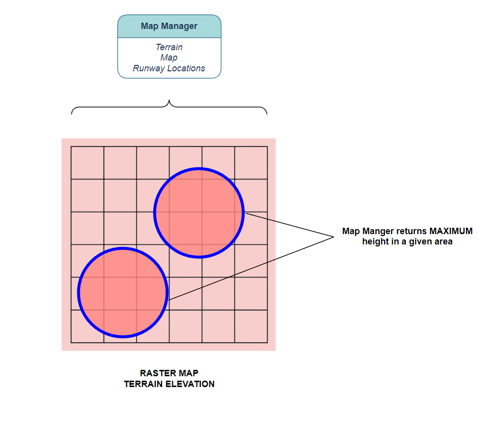

# GCAS details

## Trajectory Prediction Algorithm (TPA)

The Trajectory Prediction Algorithm (TPA) constantly calculates one or more escape manuevers given the current aircraft state.  For openGCAS, three trajectories are calculated.  The first is a wings level pull up (a vertical manuever), the second and third are turning climbs in the each direction.  For aircraft with typically low climb performance, the turning manuevers are oftentimes preferred when vertical terrain or obstacles threaten the aircraft flight path. In this case, turn performance often exceeds climb performance. For situations without vertical terrain, such as when the aircraft is descending onto a relatively flat area, the vertical trajectory is preferred. The reason for this is two fold. First the vertical trajectory is better at vertically separating from flat terrain, and second, the manuever is a more natural and easily flown avoidance manuever.
<!-- FIGURE Collision_Avoidance_Maneuver -->

*Side view of a wings level pull-up trajectory prediction (dashed line) note that its different than projecting out the current state (solid line)*

The main development effort required to produce the various TPA is to be able to model the actual dynamics of the airplane in various conditions.  This generally begins with producing a series of simulation runs, or flight test runs, of the aircraft flying the desired escape manuever.  For an automatic system, the GCAS autopilot should be used should be used to fly the manuevers, or for a manual system, the pilot should fly them.  The flight or simulation data produced from these runs should then be modeled with an accuracy required to support the nuisance and protection requirements of the system.  Verification of this model is critical to verification of the total system, so the data should be separated into two categories, learning data and verification data. If the model is overfitted to the learning data, then the verification data will show that.

In actuality, the TPA consists of a series of discritized points providing latitude, longitude, altitude, and how certain the algorithm is of this predicted location.  Each of these points are calculated with knowledge of the following variables starting at the current aircraft state.

### TPA variables
- latitude (decimal degrees)
- longitide (decimal degrees)
- gps_altitude (ft)
- bank_angle (deg)
- vertical_velocity_up (ft/sec)
- ktas (knots)
- kias (knots)
- Heading_true (deg)
- wind_direction (deg)
- wind_speed (ft/sec)
- z_accelertion (g's)
- gross_weight (lbs)
- density_altitude (ft)
- winds_down (ft/sec)

<!-- Figure TPA TOP -->

*Top down view of the 3 TPA manuevers and a depiction of the points that make them up*

## Map Manager
Once the trajectory prediction has been computed, it has to be compared with the location of the ground/terrain to understand whether there is a risk of ground collision.  Over the years, the mechanisms to determine where the ground was in relation to the aircraft have changed.  Early systems used active sensors, such as downward looking lidar or forward looking radar, to sense the relative position of the ground.  For these systems, simple calculations were used to determine predicted ground proximity. However, there were several disadvantages to this approach. For GCAS, a more robust and complete model of the elevation of the ground is required.  Luckily over the past several decades, large accurate terrain elevation databases have been created which provide this information.  Some important examples of these databases are:
- the NASA Shuttle Radar Topography Mission (SRTM) worldwide terrain database or 
- the US Digital Terrain Elevation Database (DTED) or 
- the new (and highly accurate) TerraSAR-X add-on for Digital Elevation Measurement (TanDEM-X) database

Each of these data sources have advantages and disadvantages but are also a dramatic improvement over the active sensor approach. However, because the databases cover a large portion of the land area of the earth, we need to build mechanisms that can efficiently query them.


*Shaded relief image of the TanDEM-X data.  The databases show the shape and elevation of terrain around the world*

The first step in querying the terrain database is to identify which points on the ground are relevant.  Luckily, the TPA contains a list of these points that we can directly feed into the map manager.  The map manager's job is then to return the elevation at these points.  However, since we don't know exactly where we are and can't predict with 100% certainty where we will be, we should scan the areas immediately around the TPA points as well.  The TPA calculates a horizontal uncertainty for just this purpose which is also fed into the map manager.  The map manager then returns the highest terrain elevation point in each of the areas defined by the TPA points plus uncertainty.  Once each of the TPA points has a corresponding terrain elevation provided by the Map Manager, the algorithm can determine whether a terrain avoidance manuever is warranted.

<!-- FIGURE TPA_raster -->

*The Map Manager provides the highest terrain elevation in a specified area.  The areas are circles, centered at TPA points with radii provided by the horizontal uncertainty.*

## Determining need to avoid
So, now the algorithm has a predicted trajectory and the terrain elevations underlying the TPA.  However, in order for the system to make sure that the airplane doesn't collide with terrain during the avoidance manuever there must be a buffer added in.  The height of the buffer, called the Terrain Clearance Buffer (TCB) should be dependant on the following:
- state uncertainty (such as GPS uncertainty)
- TPA uncertainty (how well the TPA has been shown to model the actual recovery)
- Terrain data uncertainty (how well the terrain databases model the actual terrain elevation)
- Timing uncertainty (how much altitude will be lost as the Monitor processes GCAS algorithm and communicates with the Controller)

Luckily, even with all of these inclusions, the TCB is only a couple of hundred feet.  This is usually acceptable because most pilots would not fly so close to the ground and missing the ground by a hundred feet or so would be fine by them.

<!-- Figure Decider -->


So, if the system senses that the TPA falls below the terrain elevation + TCB, the system will determine that the an avoidance manuever should be flown.  However, because of the order of priority of the requirements, GCAS will first do a check of all it's systems to make sure there are no errors before sending the avoidance command.  For instance, if the attitude system is malfunctioning, then the avoidance command will be inhibited (Requirement #1).  In addition, if the system detects that the airplane is flying toward the ground for normal operations (i.e. the airplane is landing), GCAS will also inhibit the avoidance manuever (Requirement #2).  These aren't the only cases when GCAS must be inhibited, these are based on a detailed analysis of the airplane failure modes and operations and should usually be a result of a systematic process such as SAE 4754 and SAE 4761 or the JARUS SORA process.


### Last Man Standing

If there is more than one potential avoidance trajectory, the system will wait until all trajectories are exhausted before issuing an avoidance command. Additionally, this "last man standing" manuever will be commanded. This is accomplished by duplicating the process of predicting a trajectory, querying the terrain database, adding a TCB, and checking for error conditions for each of the possible avoidance trajectories.  Then in the event that the system decides a collision is likely for a specific trajectory, a Need to Avoid flag for that trajectory will be set.  The system then waits until all the NTA flags are set and commands the manuever of the last one to be set.  If there is a tie between which is the last to be set, a pre-defined priority is used,usually prioritizing the level pull, then a left turn over the right.  The following is a simple pseudocode for the Need to Avoid function.

### Pseudocode for DNA

```
  bool NeedToAvoid(TPA_trajectory,
              TPA_point,
              terrainClearanceBuffer)
  {
    if(TPA_trajectory - terrain_elevation < terrainClearanceBuffer)
    {
      // we need to avoid 
      // potentially fatal scenario
      return true;
    }
    else
    {
      // no need to avoid this scenario
      // airplane is above the threshold
      return false;
    }
  }
```
