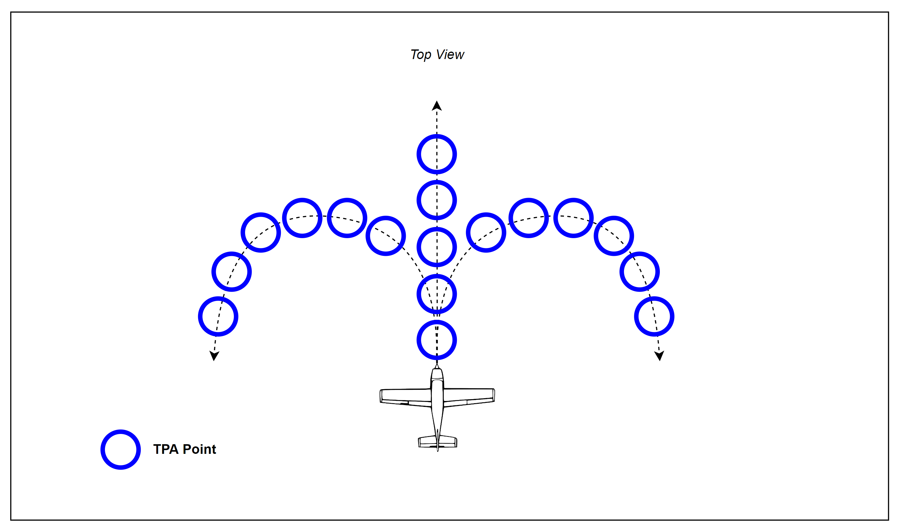
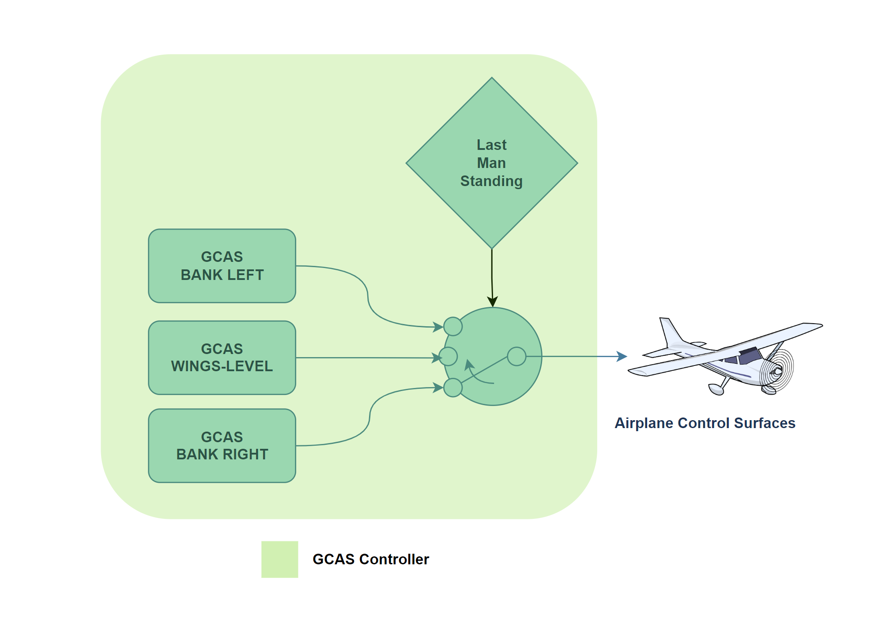

# GCAS details

## Trajectory Prediction Algorithm (TPA)

The Trajectory Prediction Algorithm (TPA) constantly calculates one or more escape manuevers given the current aircraft state.  For openGCAS, three trajectories are calculated.  The first is a wings level pull up (a vertical manuever), the second and third are turning climbs in the each direction.  For aircraft with typically low climb performance, the turning manuevers are oftentimes preferred when vertical terrain or obstacles threaten the aircraft flight path. In this case, turn performance often exceeds climb performance. For situations without vertical terrain, such as when the aircraft is descending onto a relatively flat area, the vertical trajectory is preferred. The reason for this is two fold. First the vertical trajectory is better at vertically separating from flat terrain, and second, the manuever is a more natural and easily flown avoidance manuever.
<!-- FIGURE Collision_Avoidance_Maneuver -->

*Side view of a wings level pull-up trajectory prediction (dashed line) note that its different than projecting out the current state (solid line)*

The main development effort required to produce the various TPA is to be able to model the actual dynamics of the airplane in various conditions.  This generally begins with producing a series of simulation runs, or flight test runs, of the aircraft flying the desired escape manuever.  For an automatic system, the GCAS autopilot should be used should be used to fly the manuevers, or for a manual system, the pilot should fly them.  The flight or simulation data produced from these runs should then be modeled with an accuracy required to support the nuisance and protection requirements of the system.  Verification of this model is critical to verification of the total system, so the data should be separated into two categories, learning data and verification data. If the model is overfitted to the learning data, then the verification data will show that.

In actuality, the TPA consists of a series of discritized points providing latitude, longitude, altitude, and how certain the algorithm is of this predicted location.  Each of these points are calculated with knowledge of the following variables starting at the current aircraft state.

### TPA variables
- latitude (decimal degrees)
- longitide (decimal degrees)
- gps_altitude (ft)
- bank_angle (deg)
- vertical_velocity_up (ft/sec)
- ktas (knots)
- kias (knots)
- Heading_true (deg)
- wind_direction (deg)
- wind_speed (ft/sec)
- z_accelertion (g's)
- gross_weight (lbs)
- density_altitude (ft)
- winds_down (ft/sec)

<!-- Figure TPA TOP -->

*Top down view of the 3 TPA manuevers and a depiction of the points that make them up*

## Map Manager
Once the trajectory prediction has been computed, it has to be compared with the location of the ground/terrain to understand whether there is a risk of ground collision.  Over the years, the mechanisms to determine where the ground was in relation to the aircraft have changed.  Early systems used active sensors, such as downward looking lidar or forward looking radar, to sense the relative position of the ground.  For these systems, simple calculations were used to determine predicted ground proximity. However, there were several disadvantages to this approach. For GCAS, a more robust and complete model of the elevation of the ground is required.  Luckily over the past several decades, large accurate terrain elevation databases have been created which provide this information.  Some important examples of these databases are:
- the NASA Shuttle Radar Topography Mission (SRTM) worldwide terrain database or 
- the US Digital Terrain Elevation Database (DTED) or 
- the new (and highly accurate) TerraSAR-X add-on for Digital Elevation Measurement (TanDEM-X) database

Each of these data sources have advantages and disadvantages but are also a dramatic improvement over the active sensor approach. However, because the databases cover a large portion of the land area of the earth, we need to build mechanisms that can efficiently query them.


*Shaded relief image of the TanDEM-X data.  The databases show the shape and elevation of terrain around the world*

The first step in querying the terrain database is to identify which points on the ground are relevant.  Luckily, the TPA contains a list of these points that we can directly feed into the map manager.  The map manager's job is then to return the elevation at these points.  However, since we don't know exactly where we are and can't predict with 100% certainty where we will be, we should scan the areas immediately around the TPA points as well.  The TPA calculates a horizontal uncertainty for just this purpose which is also fed into the map manager.  The map manager then returns the highest terrain elevation point in each of the areas defined by the TPA points plus uncertainty.

<!-- FIGURE TPA_raster -->

*The Map Manager provides the highest terrain elevation in a specified area.  The areas are circles, centered at TPA points with radii provided by the horizontal uncertainty.*

## Determining need to avoid
Once each of the TPA points has a corresponding terrain elevation provided by the Map Manager, the algorithm can determine whether a terrain avoidance manuever is warranted.  

TOHERE

This section describes the process by which the GCAS Monitor flags a potentially fatal scenario as TRUE, taking control of the airplane from the Complex Function (human or autopilot.)

<!-- Figure Decider -->


### Defining the Takeover Threshold

 The figure showing the decider depicts a fatal scenario where the GCAS Monitor will flag the scenario as TRUE and allow the GCAS Controller to take over the airplane. There are few critical variables in this scenario to be understood:

* **Closest Point of Approach (CPA)** - *The shortest distance between the TPA's trajectory and the terrain data.*
* **Terrain Clearance Buffer (TCB)** - *A predefined, minimum altitude threshold between the airplane and the terrain.*
 
You can observe the CPA in the image, which is the distance between the dotted line (TPA maneuver trajectory) and the TPA Points in red. The TCB can be seen in blue. Notice that the trajectory clears all but one of the Terrain Clearance Buffer instances. In this example, the maneuver being evaluated will flag NTA (Need To Avoid) as TRUE because it surpasses the minimum threshold for distance.

### Last Man Standing

Keeping in mind that three potential maneuvers are being evaluated at all times, here is where the concept of "last man standing" becomes a pivotal element in the system. By default, the Boolean value of NTA (Need To Avoid) of each controller is FALSE. In the event of a fatal scenario, each controller has a independent DNA (Determine Need to Avoid) function. As a fatal scenario begins to unfold, each controller's NTA will independently flag as TRUE if the defined threshold (TCB) is surpassed. The *final controller's NTA* to be flagged as TRUE will be used for the collision avoidance maneuver. This is done to decrease unnecessary nuisance in the system if an event does not need to be avoided.

### Pseudocode for DNA

```
  bool determineNeedToAvoid(TPA_trajectory,
              TPA_point,
              terrainClearanceBuffer)
  {
    if(TPA_trajectory - TPA_point < terrainClearanceBuffer)
    {
      // we need to avoid 
      // potentially fatal scenario
      return true;
    }
    else
    {
      // no need to avoid this scenario
      // airplane is above the threshold
      return false;
    }
  }
```

## GCAS Controller

<!-- Figure GCAS_controller -->


The GCAS Controller figure above shows the real-time controller for each potential scenario running simultaneously. To reiterate, each scenario is being evaluated individually. The last controller to be flagged NTA will be the "Last Man Standing." This particular controller will take control of the airplane and avoid the fatal event.