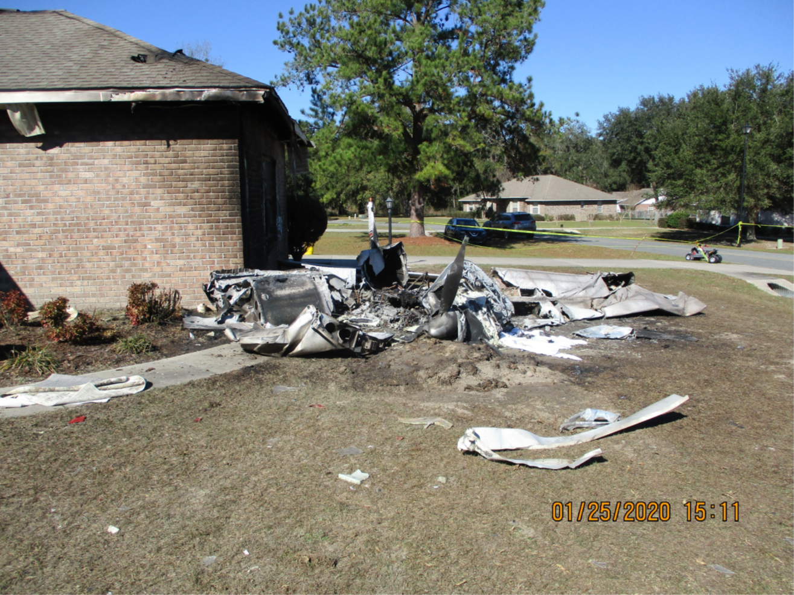
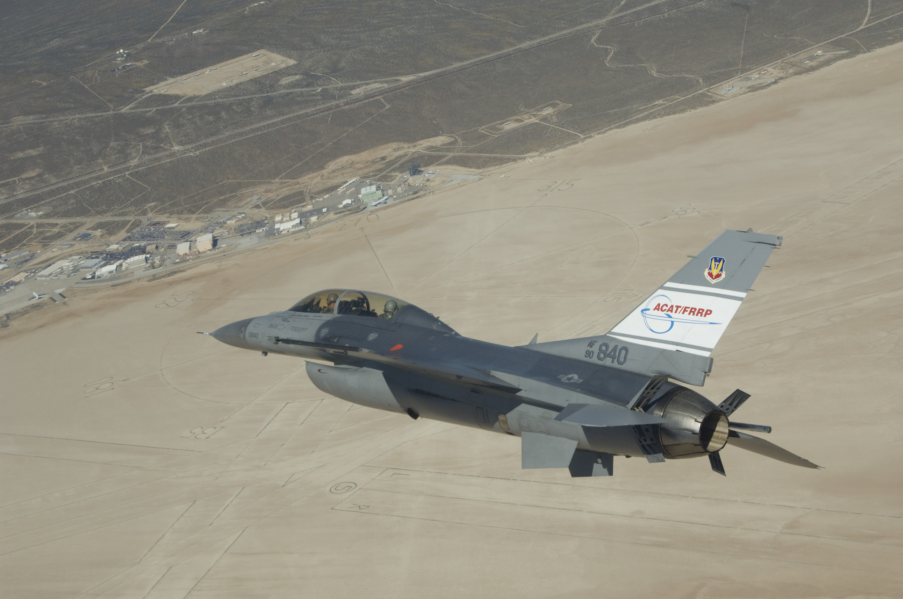

# The Ground Collision Avoidance System

## Why Ground Collision Avoidance Systems Are Needed

Ground/Terrain Collision Avoidance Systems (sometimes called "GCAS") are safety systems whose sole function is to keep perfectly good aircraft from colliding with the ground. Turns out this is a big problem in all of aviation and especially for small airplanes. In the military, accidents of this type are called "controlled flight into terrain" or CFIT, and CFIT is the #1 cause of fatal aircraft accidents for the military.  In civilian aviation, the definition of CFIT is a little different; however, if we were to apply the military definition, it would also be the #1 cause of fatal accidents.  (See [this paper][1] for more information on CFIT and the differences in definition.)   Factors such as spatial disorientation, G-induced loss of consciousness, distraction, or limited visibility cause CFIT, and unfortunately CFIT is oftentimes fatal.

We have had solid data for many years about the risks of CFIT and so, as you would expect, there have been many proposed solutions to the problem.  One of the most obvious solutions is to simply warn a pilot that a ground collision is likely.  These types of systems are called "manual" GCAS and some examples are the Terrain Awareness and Warning Systems (TAWS) and Predictive Ground Collision Avoidance System (PGCAS). In addition, many new GPS based map systems also notify the pilot if terrain ahead is above the current airplane altitude.  These manual systems have certainly saved many lives, however, they don't work when a pilot is disoriented, distracted, or unable to control the airplane and so, CFIT continues to cause aviation fatalities.  For all these other CFIT causes, only an automatic GCAS (Auto GCAS) will be able to prevent the fatalities.  This is why we are working to build open source versions of Auto GCAS in this repository.

*Wreckage of a fatal crash in Lake City, Florida.  Accidents like these are all too common in general aviation*

## Top Level GCAS Requirements
When someone starts off on the task of designing any rather complex software system, one of the first tasks is to define requirements.  Requirements are a list of statements that define how the software is required to act, and the features its required to have.  Requirements are generally broken down into top level requirements, and lower level requirements.  All of the code and all of the tests are based on this list and so requirements have to be clear, not contradictory, and complete. 

For Auto GCAS, the most important top level requirement is that Auto GCAS doesn't make safety worse.  Usually called "*Do No Harm*" this requirement seems rather obvious, but in a GCAS design it can make big differences.  For instance, prioritizing Do No Harm might mean that the system turns itself off instead of making a decision that it is not sure will improve safety.  For example, if the system can't verify that the attitude coming from the orientation sensors is correct, the system will inhibit itself.  This way the Auto GCAS doesn't erroneously pull the aircraft into the ground or something.  That would cause a bad day to be even worse!

The second top level requirement is to inhibit itself if there isn't an imminent collision.  Often called "*Do Not Interfere*," this requirement prioritizes the mission of the pilot or airplane over being as safe as conceivably possible. This may seem counter intuitive at first, but research has shown that if any automatic system is constantly interfering with normal piloting, then the pilots or operators will turn it off and it will provide no benefit.  Plus, if the pilots are constantly getting "nuisance flyups," it could actually cause a the pilot to become distracted or disoriented, contributing to safety concerns.

The third and final top level requirement is to "*Avoid Ground Collisions*".  This requirement is the lowest priority of the three top-level requirements. That means that if the system can't be sure it is helping to make things safer **or** it can't be sure that there is an actual dangerous situation, then the system will instead do nothing.  Luckily, the system can still provide excellent protection even with these hierarchical priorities.  In fact, the F-16 Auto GCAS, which also uses these priorities, has many documented Auto GCAS saves, and hasn't had a single CFIT accident since Auto GCAS was installed over 8 years ago!

*This United States Air Force F-16 is one of many F-16s with an operational Auto GCAS.  Auto GCAS has reduced F-16 CFIT fatality rates to zero since it's installation.*

## The Top Level GCAS Design

Now that we have discussed the top-level requirements, let's discuss the top-level design.  At that level, GCAS consists of two major parts: a **Ground Collision Monitor** and an **Avoidance Controller**. The main job of the Monitor is to compute the future state of the airplane and determine whether there is a high potential for a ground collision.  If the Monitor calculates that a ground collision is highly likely (and thus the flyup won't be a nuisance), it commands the Controller to fly a manuever that will avoid that collision.  The Monitor itself can also be broken down into two parts.  The first does the **Trajectory Prediction** and the second compares that trajectory to the elevations of the ground.  This second part, the **Terrain Manager** scans an on-board database of ground/terrain elevations and finds the terrain at the same latitude and longitude as the computed trajectory.  

The GCAS Controller, on the other hand, is in charge of actually taking control and flying the airplane away from the ground. For example, the controller for GCAS on the Air Force fighter airplanes are all autopilots which roll the airplane to wings level and pull away from the ground. This single maneuver is selected for the air force fighters because these airplanes have large jet engines that produce a large amount of thrust compared to the weight of the airplane. This means that these airplanes are able to climb really well. Since there is only one possible maneuver, when the GCAS monitor predicts that a ground collision is about to happen, the GCAS controller simply performs this wings level climbing maneuver. 

<!-- FIGURE: CONTROLLER INTRO -->

*The controller trajectory of a single wings level pull-up manuever*

Unfortunately, larger transport airplanes and civilian airplanes are not able to climb as well as fighter type airplanes. But, because they are generally going quite a bit slower than fighter type airplanes, they can usually turn really fast. So for these slower, lower power airplanes, the GCAS Controllers perform at least 3 maneuvers: a wings level climb, a right turning climb, and a left turning climb.  In this case, the GCAS monitor is tasked with not only needs to figure out if a ground collision is about to happen but also needs to tell the controller which maneuver it should perform. Don't worry though, figuring out which maneuver to perform is not any more complicated than figuring out if a ground collision is about to happen in the first place... It just takes a little more processing time.
<!-- 
### The GCAS Monitor

The GCAS monitor is built around a prediction of the aircraft trajectory. The predicted trajectory is step by step projection into the future of where the airplane will be and how it will be oriented. One of the most surprising things that people learn about this predicted trajectory is that it is not a prediction of how the airplane will fly if it continues flying as it currently is. Instead, the computed trajectory is a prediction of how the airplane will fly if the GCAS controller takes over. In this way the GCAS monitor can accurately say whether the GCAS controller can avoid the ground and if so, by how much.

Now, in the real world we cannot predict things with absolute certainly. For instance in aviation, a wind gust can cause the airplane to temporarily go in random ways and this we cannot predict. In fact, in the real world we can't even tell exactly where we are at any given time, or exactly how fast we are going so that any future prediction will be off just based on the erroneous starting point. This makes predicting the trajectory difficult and imprecise. That means we have to have a buffer so that any errors in our predictions don't end up causing the system to fail. So, if the predicted trajectory comes within a distance of the ground equal to or less than this buffer then the GCAS monitor will predict that a ground collision is about to happen. We call this buffer the "Terrain Clearance Buffer" or TCB. If the GCAS controller only has one maneuver, then if the predicted trajectory gets closer to the ground than the TCB then the GCAS monitor asks the GCAS controller to perform that maneuver. In the case of multiple maneuvers, the trajectory for each of the maneuvers is computed and compared to the ground. In this case, all of the maneuvers have to be within the terrain clearance buffer in order for the monitor to ask the GCAS controller to perform its maneuver. But which does it ask the controller to perform? Oftentimes, the monitor will ask the controller to fly the maneuver whose prediction entered the TCB last. Other options are that the monitor could ask the controller to fly the maneuver that has the greatest separation from the terrain.

In order for the monitor to calculate how far the predicted trajectory is away from the ground, the monitor needs to know where the ground is. For this the monitor uses very large databases of ground elevations which cover the majority of the earth. When the trajectory is predicted, the latitude and longitude of the points along the trajectory are calculated. These latitudes and longitudes are then fed into a ground elevation database and the ground altitude underneath that point in the trajectory is returned. The predicted altitude of the trajectory point is then compared to the ground elevation and if the difference between the two is less than the TCB, the monitor should determine that a ground collision along that maneuver should be avoided. -->

[1]: https://www.researchgate.net/publication/365100080_How_Digital_Safety_Systems_Could_Revolutionize_Aviation_Safety
