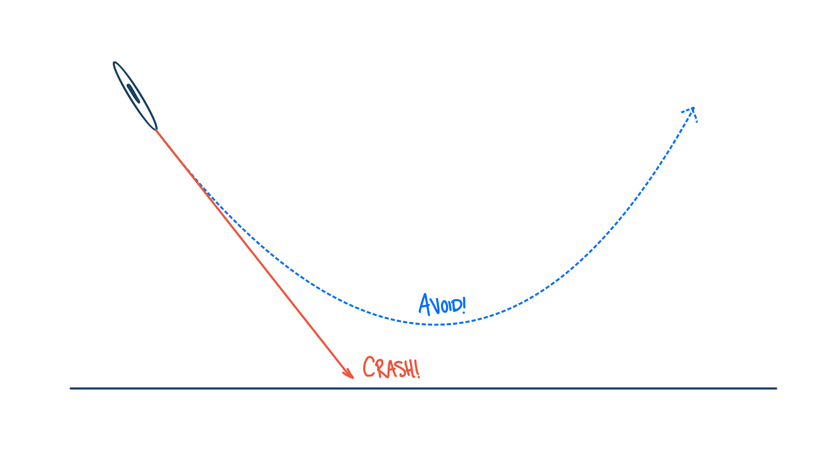

# The Ground Collision Avoidance System

## Why Ground Collision Avoidance Systems Are Needed

Ground/Terrain Collision Avoidance Systems (sometimes called "GCAS") are safety systems whose sole function is to keep perfectly good aircraft from colliding with the ground. Turns out this is a big problem in all of aviation and especially for small airplanes. In the military, accidents of this type are called "controlled flight into terrain" or CFIT, and CFIT is the #1 cause of fatal aircraft accidents for the military.  In civilian aviation, the definition of CFIT is a little different; however, if we were to apply the military definition, it would also be the #1 cause of fatal accidents.  (See [this paper][1] for more information on CFIT and the differences in definition.)   Factors such as spatial disorientation, G-induced loss of consciousness, distraction, or limited visibility cause CFIT, and unfortunately CFIT is oftentimes fatal.

We have solid data that tells us that CFIT is a big problem in aviation and so, as you would expect, there have been many proposed solutions to the problem.  One of the most obvious solutions is to make sure a pilot knows that a ground collision is likely given how and where the aircraft is flying.  Thus, there are systems called Terrain Awareness and Warning Systems (TAWS) and Predictive Ground Collision Avoidance System (PGCAS) which notify the there is a heightened risk of ground collision. In addition, many new GPS based map systems also notify the pilot if terrain ahead is above the current airplane altitude.  These "manual" systems have certainly saved many lives, however, they don't work when a pilot is disoriented, distracted, or unable to control the airplane and so, CFIT continues to cause aviation fatalities.  For all these other CFIT causes only an automatic GCAS (Auto GCAS) will be able to prevent the fatalities.  This is why we are working to build open source versions of Auto GCAS in this repository.

## How Auto GCAS Works

### The GCAS Controller

As we have mentioned, GCAS contains two major parts, the monitor and the controller. I want to begin by describing the controller because much of the monitor has to be based on how the controller acts and there are a couple of options based on which type of airplane the GCAS is designed for. For example, the controller for GCAS on the Air Force fighter type airplanes are all autopilots which roll the airplane upright and pull away from the ground. After the airplane is upright, its wings are parallel with the ground, and the nose is pointing up away from the ground the airplane begins a climbing maneuver in order to clear any mountains or ground in front of it. This single maneuver is selected for the air force fighters because these airplanes have large jet engines that produce a large amount of thrust compared to the weight of the airplane. This means that these airplanes are able to climb really well Since there is only one possible maneuver, when the GCAS monitor predicts that a ground collision is about to happen, the GCAS controller simply performs this wings level climbing maneuver. 

<!-- FIGURE: CONTROLLER INTRO -->

Unfortunately, larger transport airplanes and civilian airplanes are not able to climb as well as fighter type airplanes. However, because they are generally going quite a bit slower than fighter type airplanes they can usually turn really fast. For these slower, lower power airplanes, the GCAS controllers often are able to perform between 3 and 5 maneuvers. They can still perform a wings level climb, but they can also perform turning maneuvers which take advantage of the excellent turning ability of these airplanes. Generally, at least 3 maneuvers: a wings level climb, a right turning climb, and a left turning climb are available as options for use by the GCAS controller. In this case, the GCAS monitor not only needs to figure out if a ground collision is about to happen but also needs to tell the controller which maneuver it should perform. Don't worry though, figuring out which maneuver to perform is not any more complicated than figuring out if a ground collision is about to happen in the first place... It just takes a little more processing time.

### The GCAS Monitor

The GCAS monitor is built around a prediction of the aircraft trajectory. The predicted trajectory is step by step projection into the future of where the airplane will be and how it will be oriented. One of the most surprising things that people learn about this predicted trajectory is that it is not a prediction of how the airplane will fly if it continues flying as it currently is. Instead, the computed trajectory is a prediction of how the airplane will fly if the GCAS controller takes over. In this way the GCAS monitor can accurately say whether the GCAS controller can avoid the ground and if so, by how much.

Now, in the real world we cannot predict things with absolute certainly. For instance in aviation, a wind gust can cause the airplane to temporarily go in random ways and this we cannot predict. In fact, in the real world we can't even tell exactly where we are at any given time, or exactly how fast we are going so that any future prediction will be off just based on the erroneous starting point. This makes predicting the trajectory difficult and imprecise. That means we have to have a buffer so that any errors in our predictions don't end up causing the system to fail. So, if the predicted trajectory comes within a distance of the ground equal to or less than this buffer then the GCAS monitor will predict that a ground collision is about to happen. We call this buffer the "Terrain Clearance Buffer" or TCB. If the GCAS controller only has one maneuver, then if the predicted trajectory gets closer to the ground than the TCB then the GCAS monitor asks the GCAS controller to perform that maneuver. In the case of multiple maneuvers, the trajectory for each of the maneuvers is computed and compared to the ground. In this case, all of the maneuvers have to be within the terrain clearance buffer in order for the monitor to ask the GCAS controller to perform its maneuver. But which does it ask the controller to perform? Oftentimes, the monitor will ask the controller to fly the maneuver whose prediction entered the TCB last. Other options are that the monitor could ask the controller to fly the maneuver that has the greatest separation from the terrain.

In order for the monitor to calculate how far the predicted trajectory is away from the ground, the monitor needs to know where the ground is. For this the monitor uses very large databases of ground elevations which cover the majority of the earth. When the trajectory is predicted, the latitude and longitude of the points along the trajectory are calculated. These latitudes and longitudes are then fed into a ground elevation database and the ground altitude underneath that point in the trajectory is returned. The predicted altitude of the trajectory point is then compared to the ground elevation and if the difference between the two is less than the TCB, the monitor should determine that a ground collision along that maneuver should be avoided.

[1]: https://www.researchgate.net/publication/365100080_How_Digital_Safety_Systems_Could_Revolutionize_Aviation_Safety
