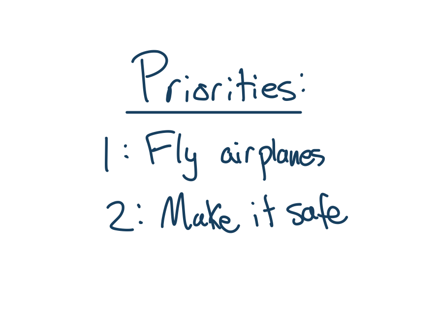

# openGCAS - Introduction


# GCAS for General Aviation (GA-GCAS)

*Loyd R. Hook, Patrick Maley, Max Hubbard, Jude Urban*
**September 23, 2022**

**Abstract**

This document conveys the motivation and history into designing collision avoidance systems. It also highlights the high-level architecture for a Ground Collision Avoidance System (GCAS) for use by General Aviation airplanes, also known as GA-GCAS.

## Considerations for Automatic Aircraft Safety Decision Making

First things first. Aircraft were made to fly, to do things in the air, and to transport people from one place to another. That's the number one priority here, bar none, that airplanes should be allowed to fly and be useful in the air! Now, if you insist on making safety the number one priority, then airplanes shouldn't be allowed to fly at all. This is because there is some non-zero risk in flying in any airplane. For large commercial airplanes, the risk is very very low. Travel in large commercial airplanes is one of the safest forms of mass travel ever devised by humans. In fact, all things being equal, it is probably safer than walking. It's a different story, however, for small airplanes. Small airplanes are actually way more dangerous, like 1000 times more dangerous (3 orders of magnitude) than large airplanes. Even when compared to traveling in a car, small airplanes are still more dangerous, but here only about 1 order of magnitude (10X) or so. 

<!-- FIGURE priorites -->


It turns out that there are some people who want to make small airplanes the safest type of airplane by not allowing them to fly at all! This scheme immediately violates our number 1 priority, that airplanes should be allowed to fly and be useful. But, if we think about things in a slightly different way, then safety doesn't go against our number one priority at all, in fact, it supports it. This is immediately obvious when you understand that crashed airplanes aren't going anywhere, and crashed pilots may not be useful anymore either. So we can, at least conceptually, make safety our number 2 priority, without conflicting with our number 1 priority, (I seriously don't understand why so many people can't get this concept). The trick will be to not interfere with normal useful aircraft operations, but to only intervene when the aircraft is in danger of immediate catastrophic uselessness (meaning in danger of a imminent crash).

This brings up the question, how do we intervene in the case of an "imminent crash"? One way that has gotten quite a bit of recent attention, is to use an airplane autopilot to maneuver in a way which keeps the aircraft from actually crashing. Another relatively popular way, is to let the pilot know that there is an imminent crash, and either depend on the pilot to figure out how to avoid the crash, or for more advanced systems, actually tell him the steps to take to avoid the crash. In general, both of these approaches fall under the general category of so called "safety systems" (or as I like to call them "digital safety decision systems" to distinguish them from other safety apparatuses). 

All safety systems work in more or less the same way. First they get certain information about where the aircraft currently is and how it is currently flying. Then they use this data to perform computations that generate a prediction of whether or not the aircraft is in immediate danger. If the system predicts that the aircraft is in immediate danger, then they either command the autopilot to perform an "avoidance manuver" (which makes the system an "automatic safety system") or they tell the pilot to perform the avoidance maneuver (which makes this type of system a "manual safety system"). It turns out, unsurprisingly perhaps, that automatic safety systems are actually quite a bit more effective than manual systems at increasing safety. It also turns out that they are generally easier to design so that they don't affect normal airplane operations. So, I am most interested in automatic safety systems and would like to focus on those from here on out. This means that in our discussion we can assume we are discussing automatic type systems unless we specifically say that what we are discussing is a manual one.

### Airplane Certification and its Effects on Safety System Design

Since we are talking about automatic safety systems, then we are talking about a system which will take control of an airplane. It turns out that it doesn't make a lot of sense to ask the pilot whether a safety system can take control, because the factors that have led to the condition which is causing the danger, are probably still affecting the pilot. So, if the pilot is disoriented or even temporarily incapacitated, asking them to approve an automatic maneuver that might end up saving their lives is probably not the best idea. Another reason is that if it is an actual emergency situation, and the pilot is aware of it, they are probably really busy dealing with the situation and adding one more button to push or one more decision to make will be counter productive. So, we must adhere to the design principle that we can take control of the aircraft without the pilots immediate permission. This causes all sorts of headaches for the Federal Aviation Administration (FAA) which is in charge of making sure that aircraft and the airspace that they fly in are safe as designed.

The FAA generally requires that all aircraft and all the systems on board an aircraft are thoroughly checked to make sure that if they fail they will not cause an accident. I say "generally" because some aircraft are experimental and there are different rules for them, but most aircraft are "certified aircraft" and they have to follow a strict set of rules for "certification". There are quite a few systems on board which may be very very unlikely to cause an accident on their own. One popular example is an in-flight entertainment system, which on its own would have a hard time causing a crash[^1]. For these "low risk" systems (called "DAL Level C" systems), they don't have to be checked very thoroughly at all. However, if a failure occurred in an automatic safety system, with access to the control of the airplane, they could very easily **CAUSE** a crash! The FAA understands this and so they require that all of these "flight critical systems" (DAL Level A), to be designed and checked with excruciating detail to make sure they will not cause a crash.

So how does certification affect safety system development? First of all, it means that the number one requirement of any safety system is that it doesn't contribute to an accident. Second of all, because the amount of work required to check and certify a system goes up exponentially with the with the system complexity, the systems should be made as simple as possible. This means that each safety system should be made as simple as possible, so generally, the way this is done is to restrict each safety system to only one piloting function.

<!-- FIGURE complexityVsTesting -->


There are many things that a pilot must do to make sure that the aircraft does not crash. They must simultaneously make sure they don't crash into another aircraft, make sure they don't crash into the ground, make sure they don't stall, they have to avoid really bad weather, etc. In addition, they have to do all of this safety planning and decision making while doing the normal and useful job of flying. We call each of these safety planning and decision tasks "safety functions". Each safety function is concerned with only one type of threat to the aircraft. So, if we are trying to make each safety system as simple as possible, then we want to restrict each safety system to only be concerned with 1 safety function. Now how do these functions interact with each other? What about times when there are conflicts between them? How do we prioritize safety functions? How is the normal useful piloting prioritized? One particular approach to answering these questions that has recently grown quite popular is the "Run-time assurance" approach which will be discussed in the next section.

## RTA Decision Architecture

Before we get into the technical details of the run-time assurance approach, let's discuss the history and ways of thinking that led to its development. First of all, run-time assurance, as a concept, has a relatively long history and has went through several name changes along the way. The very basic idea was generated to solve a problem that is understood to all people who have ever coded anything before. The problem is that software fails. What makes that problem a super critical one to address is that sometimes software failures result in a risk of injury or even dying. The hard thing about software is that it doesn't fail like other "hard" systems. Everything can work flawlessly 99 times out of a 100 and then on the 100th time a special combination of inputs can drive the software to a state which it does something extreme. So, no matter how many tests you run on the software and how many times it passes, you can never be sure that the software is infallible. 

Back at the early days of NASA, rockets were controlled using computerized control systems driven by software. The NASA engineers working on these rocket control systems knew that a bug in the software could cause the rocket to go out of control very quickly and possibly kill quite a few people. So, they decided to build two completely different control systems, put them both on the rocket, and switch from the main controller to a backup controller if the rocket started doing something unexpected. They figured that since the controllers were different, they wouldn't fail at exactly the same point, and so if one failed the other would very very likely work properly. This approach was used at NASA for many decades actually, and not just on rockets but also on airplanes in research control systems. 

Then around 1998 or so, a couple of researchers at the University of Illinois used some rather brilliant analysis to show that a simpler backup system actually provided better immunity to errors than a more complicated one. They termed this approach the "Simplex" architecture and it was based on a few core (and also very realistic assumptions). The first assumption is that the number of bugs in a piece of software scales with software complexity. This means that the more complex a piece a software the more bugs it will contain (at least initially). The second assumption is that the rate at which bugs can be eliminated from a piece of software is initially high, but then decreases towards zero as the bugs get harder and harder to track down and understand. This has the effect that it takes an ever increasing amount of effort to find and correct a bug as the project becomes more mature. These two assumptions, plus the fact that there is always a limited amount of resources on any project, means that a structure with a simple backup system will actually be more reliable than one with a complicated backup, given an equal amount of effort between the two approaches. 

<!-- FIGURE simpleComplex -->


The Simplex architecture approach changed thinking about software reliability and software redundancy. Then as the approach was adapted to the complex world of aviation, an extension was needed. This came in the form of the run-time assurance approach, which allows for multiple simple backup controllers each with a safety function they are monitoring. The name run-time assurance comes from the idea that in aviation, most software is verified before it is ever put on an airplane. This is the extensive checking that we discussed that the FAA require. But, using the concepts developed in the Simplex papers, checking the system at "run-time" and assuring aircraft safety with backup controllers may be a better way moving forward.

### The Run-Time Assurance Approach

The run-time assurance (called RTA from here on) approach then basically contains two critical parts. The first does the checking and it is called a run-time monitor. These monitors check the state of the aircraft, perform some calculations on that state, and then determine if the underlying system has a bug (or has done something that will lead to a safety issue). The second part is a backup controller. This backup controller brings the aircraft state back into a safe place and only takes over when the monitor calculates that something is wrong.

<!-- Figure: highLevelRTA -->


Conceptually, RTA monitors and backup controllers can be composed of any combination of computer and/or humans. For instance, the RTA monitor can be a computer program that is constantly evaluating the aircraft location to make sure it is not in a dangerous place. If it is, the RTA can tell the pilot that he needs to fly somewhere else. When posed in this form, the RTA concept is not all that different from the myriad of warnings and system checkers that one would find on many modern aircraft today. However, for the automatic safety systems that we are concerned with in this paper, both the monitoring and the controlling is done by a computer. In this case, we like to group these two components together and call it a system, and remember that each system will be responsible for only one safety function. The most mature of these safety systems is the Ground Collision Avoidance System, or GCAS.

### Ground Collision Avoidance in an RTA architecture

This section highlights the high-level architecture for the Real-Time Assurance (RTA) for the GA-GCAS. The high level RTA figure contains a generic diagram for any RTA control system. The RTA is responsible for selecting between a number of different control systems in real time. For example, the diagram contains one primary control system called the Complex Function. The Complex Function is either human control or autopilot. Running in parallel to the Complex Function are the Recovery Control Functions. Their sole purpose is to provide an escape route in a potentially fatal scenario. In addition, a monitor is required to select between the different control systems in an imminent fatal event. The selector is known as the Safety Monitor.

Now, the generic diagram described in the previous section will be translated into a specific implementation for GA-GCAS. At any given moment, both the GCAS Monitor and the GCAS Controller are evaluating the scenario at present, planning an escape to a fatal event should one arise. The GCAS Monitor's role is a high level evaluation of the situation as a whole, performing calculations to Determine Need to Avoid (DNA.)
The GCAS Monitor's evaluation of the situation is sent to the "Decider", where a switch can be toggled between normal (human or autopilot) control and GCAS control.

<!-- Figure RTA_Decision_Structure -->


## GA-GCAS Architecture

The state of the airplane will be given by sensor data, which includes position, velocity, altitude, and so on. This state information feeds the Trajectory Prediction Algorithm (TPA) with necessary data.
Meanwhile, the surroundings and TPA provide the Map Manager with information about the environment.
The output of these two systems will be sent to a comparator, where Determine Need to Avoid (DNA) will be calculated.
DNA is a Boolean value based on the output of this comparator.

The airplane's autopilot control coupler will switch between GCAS and normal (human or autopilot control) when necessary. 

<!-- GCAS_architecture -->


## TPA

The purpose of the Trajectory Prediction Algorithm (TPA) calculate a trajectory in which an obstacle is avoided. The figure below shows a lateral view of the Trajectory Prediction Algorithm's calculated trajectory. The TPA's calculated path is represented by the dotted line.

<!-- FIGURE Collision_Avoidance_Maneuver -->


### Collision Avoidance Maneuvers

<!-- Figure TPA TOP -->


The purpose of TPA figure is twofold: visualize the TPA's three potential maneuvers, and to introduce the concepts of TPA points. Beginning with the TPA's three potential maneuvers, it should be noted that the figure shows the same scenario as the collision avoidance manuever shown below, but from an overhead view. There are three potential maneuvers that the TPA will consider:

* *Pull up, bank left
* Pull up, wings level
* Pull up, bank right

The process by which a maneuver is selected will be defined in the section Last Man Standing.

### TPA Points

<!-- FIGURE TPA_raster -->


This section documents the process by which a TPA point is defined. To begin, a circular surface area of an arbitrary radius will be defined. This finite domain will be cross-referenced with terrain data. The *largest* data point in the terrain data (which happens to be the highest elevation) will be defined as the TPA Point for that particular location. This coarsening, discretization of terrain data is done to remove any uncertainties in the terrain data. By selecting the highest point in a given area, the system is assuming the worst case scenario at all times. This adds to the safety cushion threshold of the system, and thus, makes it more likely to save lives.

## Decider

This section describes the process by which the GCAS Monitor flags a potentially fatal scenario as TRUE, taking control of the airplane from the Complex Function (human or autopilot.)

<!-- Figure Decider -->


### Defining the Takeover Threshold

 The figure showing the decider depicts a fatal scenario where the GCAS Monitor will flag the scenario as TRUE and allow the GCAS Controller to take over the airplane. There are few critical variables in this scenario to be understood:

* **Closest Point of Approach (CPA)** - *The shortest distance between the TPA's trajectory and the terrain data.*
* **Terrain Clearance Buffer (TCB)** - *A predefined, minimum altitude threshold between the airplane and the terrain.*
 
You can observe the CPA in the image, which is the distance between the dotted line (TPA maneuver trajectory) and the TPA Points in red. The TCB can be seen in blue. Notice that the trajectory clears all but one of the Terrain Clearance Buffer instances. In this example, the maneuver being evaluated will flag NTA (Need To Avoid) as TRUE because it surpasses the minimum threshold for distance.

### Last Man Standing

Keeping in mind that three potential maneuvers are being evaluated at all times, here is where the concept of "last man standing" becomes a pivotal element in the system. By default, the Boolean value of NTA (Need To Avoid) of each controller is FALSE. In the event of a fatal scenario, each controller has a independent DNA (Determine Need to Avoid) function. As a fatal scenario begins to unfold, each controller's NTA will independently flag as TRUE if the defined threshold (TCB) is surpassed. The *final controller's NTA* to be flagged as TRUE will be used for the collision avoidance maneuver. This is done to decrease unnecessary nuisance in the system if an event does not need to be avoided.

### Pseudocode for DNA

```
    bool determineNeedToAvoid(TPA_trajectory,
                            TPA_point,
                            terrainClearanceBuffer)
    {
        if(TPA_trajectory - TPA_point < terrainClearanceBuffer)
        {
            // we need to avoid 
            // potentially fatal scenario
            return true;
        }
        else
        {
            // no need to avoid this scenario
            // airplane is above the threshold
            return false;
        }
    }
```

## GCAS Controller

<!-- Figure GCAS_controller -->


THe GCAS Controller figure above shows the real-time controller for each potential scenario running simultaneously. To reiterate, each scenario is being evaluated individually. The last controller to be flagged NTA will be the "Last Man Standing." This particular controller will take control of the airplane and avoid the fatal event.

<!-- footnotes -->
[^1]: In flight entertainment systems run on separate power systems from other more critical systems so that a failure in the in-flight entertainment system wouldn't cause a failure of a more critical one.